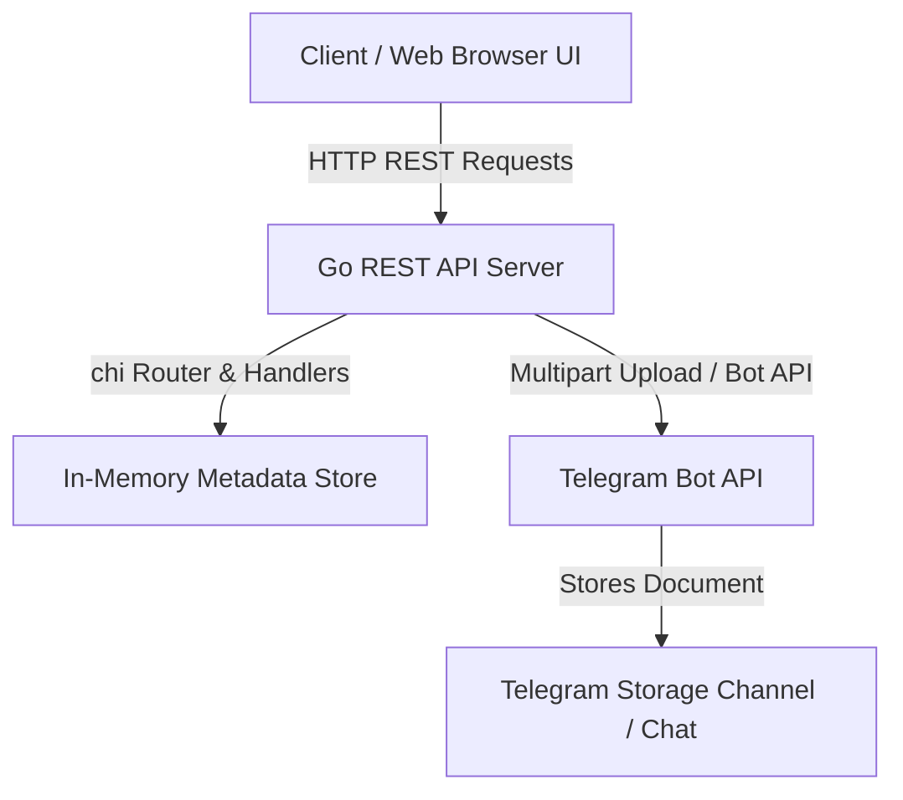

# 🚀 Telegram File Storage Service

[](https://golang.org/)
[](https://github.com/go-chi/chi)
[](https://opensource.org/licenses/MIT)

A high-performance Go RESTful API service that leverages the **Telegram Bot API** as a cloud storage backend. Upload, manage, stream, and download files of any format through an intuitive REST API and built-in interactive Web UI dashboard.

---

## ✨ Features

- 📤 **File Uploads**: Stream file uploads directly to Telegram storage channels.
- ⚡ **High-Performance Streaming**: Stream media directly to clients from Telegram with `Content-Type` detection and dynamic range support.
- 🔍 **Real-Time Update Sync**: Automatically sync file metadata directly from Telegram channel updates.
- 🏷️ **Smart Filename Resolution**: Automatic RFC 5987 filename preservation and fallback extension detection.
- 🛡️ **Interactive Web UI**: Modern dark-mode dashboard built for live API testing and file management.
- 🔒 **CORS & Middleware**: Pre-configured with Chi logger, recoverer, and flexible CORS headers.

---

## 🛠️ Architecture



---

## 🚀 Quick Start

### 1. Prerequisites

- **Go** 1.25 or higher
- A **Telegram Bot Token** (from [@BotFather](https://t.me/BotFather))
- A **Telegram Chat/Channel ID** where your bot has permission to post messages.

### 2. Configuration

Clone the repository and copy `.env.example` to `.env`:

```bash
cp .env.example .env
```

Edit `.env` with your credentials:

```env
# Telegram Bot Configuration
TELEGRAM_BOT_TOKEN=your_bot_token_here
TELEGRAM_CHAT_ID=your_chat_or_channel_id

# Server Configuration
PORT=8080
MAX_UPLOAD_SIZE_MB=50
```

### 3. Run the Service

```bash
# Install dependencies
go mod download

# Start the service
go run main.go
```

The service will start at `http://localhost:8080`.
Open `http://localhost:8080/` in your browser to access the **Interactive API Documentation & Testing UI**.

---

## 📑 API Reference

| Endpoint | Method | Description | Query Parameters |
| :--- | :---: | :--- | :--- |
| `/health` | `GET` | API Health Check | None |
| `/api/upload` | `POST` | Upload file (`multipart/form-data`) | `file` field in form-data |
| `/api/download` | `GET` | Stream / Download file | `file_id` (required), `file_name` (optional), `dl=1` (force download) |
| `/api/info` | `GET` | Get raw Telegram file info | `file_id` (required) |
| `/api/messages/{message_id}` | `DELETE` | Delete message on Telegram & Store | None |

---

## 🧪 Example API Requests

### 1. Upload a File

```bash
curl -X POST http://localhost:8080/api/upload \
  -F "file=@/path/to/example.png"
```

**Response (`201 Created`):**
```json
{
  "status": "success",
  "data": {
    "file_id": "BQACAgUAAxkDA...",
    "file_unique_id": "AgAD...",
    "message_id": 123,
    "file_name": "example.png",
    "file_size": 204800,
    "mime_type": "image/png",
    "created_at": "2026-08-25T10:00:00Z",
    "download_url": "/api/download?file_id=BQACAgUAAxkDA...&file_name=example.png"
  }
}
```

### 2. Stream or Direct Download

- **Stream / Preview in browser:**
  ```
  GET /api/download?file_id=BQACAgUAAxkDA...&file_name=example.png
  ```

- **Force direct download attachment:**
  ```
  GET /api/download?file_id=BQACAgUAAxkDA...&file_name=example.png&dl=1
  ```

---

## 📂 Project Structure

```
tele_storage/
├── config/             # Environment & configuration loader
├── handlers/           # HTTP server routes and REST API logic
├── telegram/           # Telegram Bot API client & in-memory store
├── static/             # Interactive UI Dashboard (HTML, CSS, JS)
├── .env.example        # Environment template
├── go.mod              # Go module definition
├── LICENSE             # MIT License
├── main.go             # Application entrypoint
└── README.md           # Documentation
```

---

## 📄 License

This project is licensed under the **MIT License** - see the [LICENSE](LICENSE) file for details.
